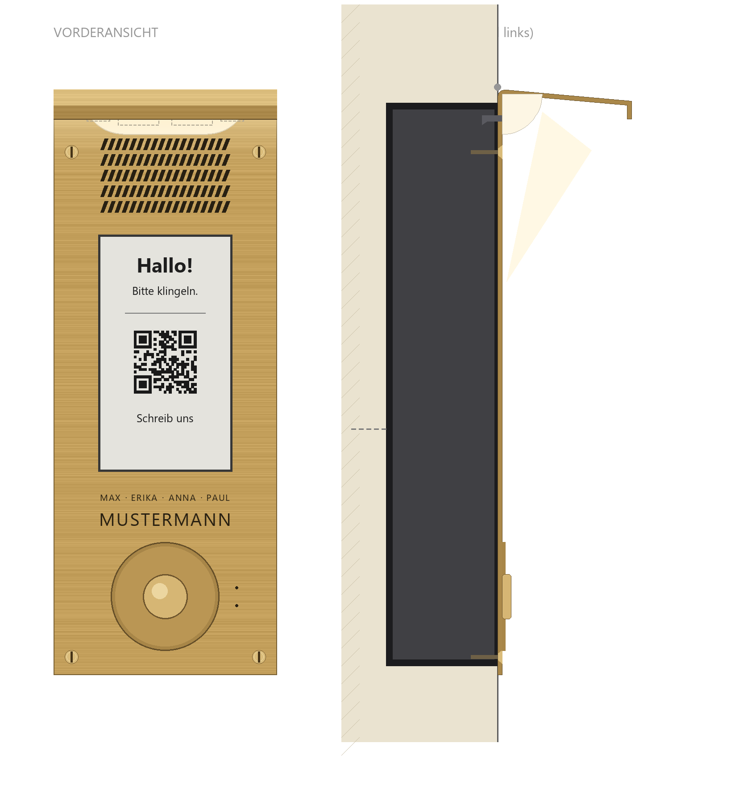
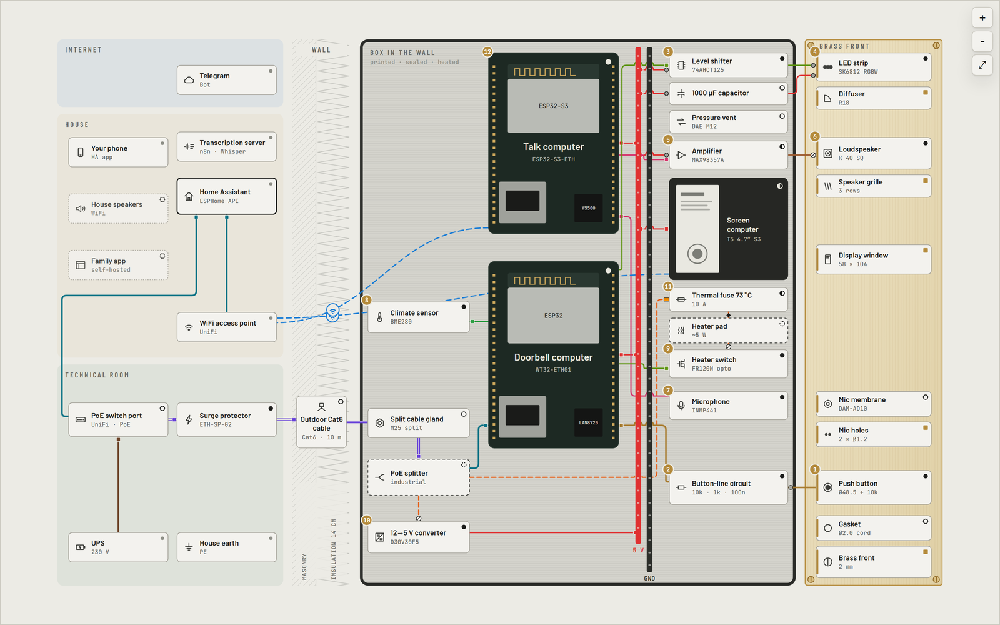

# Klingelbox

**Eine offene Türsprechstelle: Messingfront bündig in der Fassade, E-Paper-Touchscreen,
Gegensprechen und ein einziges PoE-Kabel. Gebaut mit ESP32, ESPHome und Home Assistant.
Keine Kamera, niemals.**

[English](README.md)

> Stand: Prototyp. Die Teile liegen auf dem Labortisch, Front und Kasten gibt es als
> 3D-gedruckte Prototypen. An einer Tür ist noch nichts montiert. Stand dieser Seite: 24.09.2026.

  

## Was es ist

- **Zuerst eine Klingel.** Ein einfacher Messingtaster an einer überwachten Leitung: Ruhe,
  gedrückt und Drahtbruch ergeben drei verschiedene Spannungen. Ein kaputtes Kabel wird gemeldet,
  statt still zu bleiben. Die Meldung ist auf dem Handy, bevor an der Tür irgendetwas anderes passiert.
- **Ein Bildschirm an der Tür.** 4,7-Zoll-E-Paper mit Touch hinter einem Fenster im Messing:
  Begrüßung, Hinweise, QR-Code. Das Bild bleibt ohne Strom stehen und ist in der Sonne lesbar.
- **Sprechen.** Mikrofon und Lautsprecher hinter dem Messing für Gespräche, über Home Assistant
  aufs Handy. Geplant: Sprachnachrichten und Push-to-Talk ins Haus.
- **Ein Kabel.** Daten und Strom kommen über ein einziges PoE-Außenkabel. Kein Netzteil an der
  Tür, kein Switch im Kasten.
- **Lokal.** Alles läuft mit ESPHome und Home Assistant im eigenen Haus.
- **Datenschutz eingebaut.** Keine Kamera. Das Mikrofon öffnet erst, wenn jemand an der Tür
  etwas drückt, und der Bildschirm zeigt das an.

## Ansehen

Der [Explorer](explorer/) ist eine interaktive Karte des ganzen Systems, auf Deutsch und Englisch:
Leitungsarten ein- und ausblenden, jedes Teil antippen, Rundgänge durch ein Klingeln, den Stromweg,
die Winterheizung und ein Gespräch. [`explorer/dist/klingelbox-explorer.html`](explorer/dist/klingelbox-explorer.html)
herunterladen und im Browser öffnen. Eine gehostete Version ist geplant.

## Wie es funktioniert

Drei kleine Rechner teilen sich ein Kabel und eine 5-V-Schiene, sonst nichts:

| Rechner | Platine | Verbindung | Aufgabe |
|---|---|---|---|
| Klingel | WT32-ETH01 | Kabel | Klingelleitung, Licht, Heizung, Klimasensor |
| Sprechen | Waveshare ESP32-S3-POE-ETH | WLAN | Mikrofon, Verstärker, Gespräche |
| Bildschirm | LilyGO T5-4.7-S3 Touch | WLAN | E-Paper-Touchscreen |

Die Klingel läuft auf einer eigenen Platine nur mit Standard-ESPHome. Ein Absturz oder ein Update
im Audiocode kann sie deshalb nie stumm schalten. Details, Strombudget und Winterheizung stehen in
[docs/architecture.md](docs/architecture.md) (Englisch).

## Inhalt

| Pfad | Was |
|---|---|
| [`docs/architecture.md`](docs/architecture.md) | Aufbau, Strom, Winter, Sprechen, Mechanik |
| [`docs/bom.md`](docs/bom.md) | Einkaufsliste mit den Fallen (falsche „Touch“-Angebote, Kabel mit Aluminiumkern) |
| [`docs/roadmap.md`](docs/roadmap.md) | die Meilensteine vom Tisch bis zur Tür und die offenen Entscheidungen (Englisch) |
| [`docs/build-log.md`](docs/build-log.md) | was bisher passiert ist, auch die Sackgassen |
| [`docs/family-app.md`](docs/family-app.md) | die geplante selbst gehostete App für den Haushalt |
| [`hardware/`](hardware/) | Front, Kasten und Diffusor: Skripte, STL und STEP, Maßzeichnungen der Teile |
| [`explorer/`](explorer/) | die interaktive Karte und ihr Build |
| [`tools/`](tools/) | der Datenschutz-Scan vor jedem Push |

Die Firmware (ESPHome-YAML) und die Home-Assistant-Automationen kommen dazu, sobald sie die
Tests auf dem Labortisch bestanden haben.

## Sicherheit

- Der Überspannungsschutz schützt nur geerdet. Das und alles an 230 V ist Sache eines Elektrikers.
- Das E-Paper-Panel ist für 0 bis +50 °C freigegeben. Draußen braucht es die Heizung, und die
  Heizung braucht ihre Thermosicherung.
- Nie den USB-Anschluss einer Platine an einen Computer stecken, solange die 5-V-Schiene im
  Kasten Strom hat, außer das Kabel sperrt die Versorgung.

## Lizenzen

- Code (Skripte, Explorer, Firmware): [MIT](LICENSE)
- Hardware (CAD-Skripte, STL, STEP, Zeichnungen): [CERN-OHL-P-2.0](LICENSES/CERN-OHL-P-2.0.txt)
- Dokumentation und Bilder: [CC BY 4.0](LICENSES/CC-BY-4.0.txt)

Entworfen und geschrieben mit [Claude Code](https://claude.com/claude-code).
